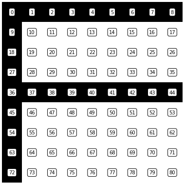
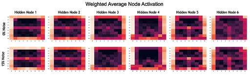

<!-- HEADER -->
 

  <h3 align="center">Neural Net From Scratch/h3>
  

     Coursework from Northwestern University MSDS 458 - Artificial Intelligence and Deep Learning

---
<!-- ABOUT THE Course -->
## Overview
This is a project from a course I took on deep learning. We built a deep neural net from scratch, then trained it to recognize various "letters" encoded as a Python list of 81 binary integers, wherein values of 1 or 0 are used to create a 9x9 bitmap representation of a letter.

*For example, the letter F*

By training the network to recognize combinations of pixel values, we then could extract weighted activation values from each of the the 6 hidden nodes to see which nodes were learning which letter "features".

For a more complete explanation, read the included reports :)
